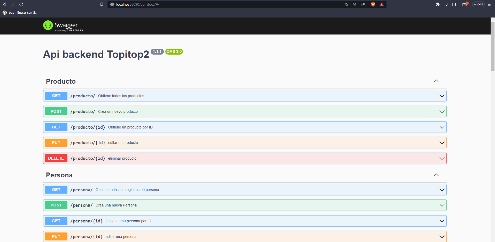

# Backend de la tienda topitop

## Tabla de Contenidos

- [Instalación](#instalación)
- [Uso](#uso)

## Instalación

1. Clona este repositorio:

   ```shell
   git clone https://github.com/Nelson-Choque/inventory-store.git
   ```

2. Instala dependencias

   ```shell
   npm install
   ```

## Uso

1.- iniciar la aplicacion

```shell
npm start
```

2.- iniciar modo desarollo

```shell
npm run dev
```

## Configuración de la Base de Datos

Para que la aplicación funcione correctamente, es necesario configurar la conexión con la base de datos. En el archivo `src/db/connection.js` encontrarás el siguiente fragmento de código que debes modificar segun tus credenciales:

```javascript
const connection = mysql.createConnection({
  database: "topitop",
  host: "localhost",
  user: "",
  password: "",
});
```

## Documentacion de la api

puedes ver la documentacion de los endpoints que se realizo con swagger en la siguiente ruta

```
/api-docs/

```


